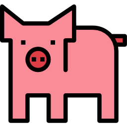

<h2 align="center"> 
   

<h1 align="center"> Churrascômetro </h1>

    <a href="#demo"> Demonstração</a> •
    <a href="#func"> Funcionalidade</a> •
    <a href="#tec"> Tecnologias</a> •
    <a href="#projeto"> Projeto</a> 
        

<h2 id="demo"> 📷 Demonstração </h2>

<h2 align="center">  </h2>
<h2 align="center">  </h2>

 

<h2 id="func"> ⚙ Funcionalidades </h2>

 - [x] Design moderno e intuitivo  
 - [x] Seleção de texto com tema da página 
 - [x] Input com seletor de números 
 - [x] Eventos DOM  
 - [x] Responsividade    

<h2 id="tec"> 🚀 Tecnologias </h2>

 Esse projeto foi desenvolvido com as seguintes tecnologias: 
 

✔️HTML  
✔️CSS  
✔️Javascript  

<h2 id="projeto"> 💻 Projeto </h2>

Esse projeto foi criado com intuito de calcular a quantidade de bebidas alcoólicas, carnes e bebidas não alcoólicas para um churrasco por um determinado número de horas com um número determinado de adultos e crianças. O site tem como objetivo praticar conceitos de responsividade, eventos DOM e cálculos em Javascript, design moderno e afins. 
Sitema para calcular a quantidade de comida e bebida necessária para um churrasco,
com base nas informações seguintes:
Carne - 400gr por pessoa + de 6horas - 650gr
Cerveja - 1200ml por Pessoa + 6 horas - 2000ml
Refrigerante/água - 1000ml por pessoa + 6 horas 1500ml
Crianças valem por 0,5.
 
 

 

 Criado por Lucas Freitas 🖖🏽 | <a href="https://www.linkedin.com/in/lucasfreitas01/"> Faça contato comigo </a> 
 
